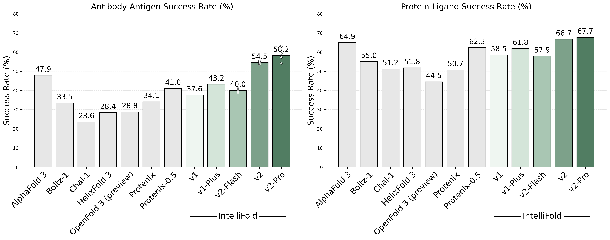

# IntelliFold: A Controllable Foundation Model for General and Specialized Biomolecular Structure Prediction
[](https://huggingface.co/intelligenAI/intellifold)
[](https://pypi.org/project/intellifold/)
[](LICENSE)
[](#contact-us)


<div align="center" style="margin: 20px 0;">
  <span style="margin: 0 10px;">⚡ <a href="https://server.intfold.com">IntelliFold Server</a></span>
  &bull; <span style="margin: 0 10px;">📄 <a href="https://www.biorxiv.org/content/10.64898/2026.02.09.704787v1">IntelliFold 2 Release Note</a></span> &bull; <span style="margin: 0 10px;">📄 <a href="https://arxiv.org/abs/2507.02025">IntelliFold Technical Report</a></span>
</div>


## 📰 News

 - **2026-06-15**: IntelliFold-v2 now runs on the **[AlphaFold 3](https://github.com/google-deepmind/alphafold3) JAX engine**. AlphaFold 3's JAX inference is fast, and as of [**v3.0.3** it is released under the **Apache-2.0** license](https://github.com/google-deepmind/alphafold3/releases/tag/v3.0.3) — so we leverage their repository to accelerate IntelliFold-2 inference. See [Usage](#-usage) to install and run.
 - **2026-02-07**: We are excited to present [[IntelliFold 2]](https://www.biorxiv.org/content/10.64898/2026.02.09.704787v1). This version represents a
major architectural update and is one of the first open-source models to outperform AlphaFold3 on
Foldbench.  


## 📊 Benchmarking
To comprehensively evaluate the performance of IntelliFold 2, we conducted a rigorous evaluation on [FoldBench](https://github.com/BEAM-Labs/FoldBench). We compared IntelliFold against several leading methods, including [Boltz-1,2](https://github.com/jwohlwend/boltz), [Chai-1](https://github.com/chaidiscovery/chai-lab), [Protenix](https://github.com/bytedance/Protenix) and [Alphafold3](https://github.com/google-deepmind/alphafold3).

For more details on the benchmarking process and results, please refer to our release note [IntelliFold 2 Release Note](https://www.biorxiv.org/content/10.64898/2026.02.09.704787v1) and [IntelliFold Technical Report](https://arxiv.org/abs/2507.02025).




## 🔍 Usage

### Setup

If your environment already has **alphafold3** installed, just add this wrapper from PyPI:

```bash
pip install intellifold
```

Otherwise install the vendored AlphaFold 3 engine first. Clone the repo, build the engine and its CCD
data with `build_data` (reads libcifpp's bundled `components.cif` — no network, ~30s), then install
the wrapper:

```bash
git clone https://github.com/IntelliGen-AI/IntelliFold
cd IntelliFold
pip install ./third_party/alphafold3 && build_data
pip install intellifold        # or `pip install .` from the clone
```

`jax[cuda12]` ships its own CUDA libraries and uses the GPU out of the box. **If it instead falls back
to CPU** (`cuSPARSE ... not found`), a system CUDA on your `LD_LIBRARY_PATH` is shadowing the bundled
ones — put the bundled libraries first:

```bash
export LD_LIBRARY_PATH=$(ls -d "$(python -c 'import nvidia,os;print(os.path.dirname(nvidia.__file__))')"/*/lib | paste -sd:):$LD_LIBRARY_PATH
```

### Inference

The input is an [AlphaFold 3-style JSON](https://github.com/google-deepmind/alphafold3/blob/main/docs/input.md).
On the first run the pre-converted IntelliFold-v2 weights are downloaded from Hugging Face into
`./model_v2` (later runs just load them).

**Quick start** — the example `fold_input.json` already contains its MSAs and templates, so skip the
data pipeline with `--norun_data_pipeline`:

```bash
wget https://huggingface.co/intelligenAI/intellifold/resolve/main/fold_input.json
intellifold predict fold_input.json --model-dir=model_v2 --output-dir results -- --norun_data_pipeline
```

**Search MSAs yourself** — if your JSON has no MSAs, first download the sequence databases, then point
`--db_dir` at them (AF3 runs its data pipeline to build MSAs/templates):

```bash
bash third_party/alphafold3/fetch_databases.sh /path/to/databases
intellifold predict fold_input.json --model-dir=model_v2 --output-dir results -- --db_dir=/path/to/databases
```

**Batch a directory across every GPU** — predicts every JSON in the directory (one worker per GPU,
self-balancing local queue, resumable — rerun to continue):

```bash
intellifold predict ./my_inputs/ --model-dir=model_v2 --gpus all --output-dir results -- --norun_data_pipeline
```

**`--` passes everything after it straight through to AlphaFold 3** (its own flags) — e.g.
`--norun_data_pipeline`, `--db_dir=/path/to/databases`, `--num_diffusion_samples=5`. Set `HF_ENDPOINT`
(e.g. `hf-mirror.com`) for a download mirror.

### How the IntelliFold JAX weights were produced

The hosted `intellifold_v2.bin.zst` + `intellifold_v2_fourier.npz` were converted from the
IntelliFold-v2 **PyTorch** checkpoint with [`convert_ifv2_to_jax.py`](convert_ifv2_to_jax.py). To
convert your own `.pt` (needs torch, `pip install '.[convert]'`):

```bash
python convert_ifv2_to_jax.py --schema intellifold/af3_schema.pkl --v2-pt intellifold_v2.pt --out-dir model_v2
```


## 🌐 IntelliFold Server

**We highly recommend using the [IntelliFold Server](https://server.intfold.com) for the most accurate, complete, and convenient biomolecular structure predictions.** It requires no installation and provides an intuitive web interface to submit your sequences and visualize results directly in your browser. The server runs the **full, optimized, latest** IntelliFold implementation for optimal performance.


## 📜 Citation

If you use IntelliFold in your research, please cite our paper:

```
@article{qiao2026intellifold,
  title={IntelliFold-2: Surpassing AlphaFold 3 via Architectural Refinement and Structural Consistency},
  author={Qiao, Lifeng and Yan, He and Liu, Gary and Guo, Gaoxing and Sun, Siqi},
  journal={bioRxiv},
  year={2026},
  publisher={Cold Spring Harbor Laboratory}
}

@article{team2025intfold,
  title={IntFold: A Controllable Foundation Model for General and Specialized Biomolecular Structure Prediction},
  author={Team, The IntFold and Qiao, Leon and Bai, Wayne and Yan, He and Liu, Gary and Xi, Nova and Zhang, Xiang and Sun, Siqi},
  journal={arXiv preprint arXiv:2507.02025},
  year={2025}
}
```


## 🔗 Acknowledgements

- This repository runs IntelliFold-v2 on the **AlphaFold 3** JAX inference engine by Google DeepMind ([Apache-2.0](https://github.com/google-deepmind/alphafold3)), vendored at [`third_party/alphafold3/`](third_party/alphafold3) (v3.0.3). The wrapper's `run_jax_inference.py` is a modified copy of AF3's; see [`NOTICE`](NOTICE).
- The implementation of **fast layernorm operators** is inspired by [OneFlow](https://github.com/Oneflow-Inc/oneflow) and [FastFold](https://github.com/hpcaitech/FastFold), following [Protenix](https://github.com/bytedance/Protenix)'s usage. 
- Many components in `intellifold/openfold/` are adapted from [OpenFold](https://github.com/aqlaboratory/openfold), with substantial modifications and improvements by our team (except for the `LayerNorm` part).  
- This repository, the implementation of **Inference Data Pipeline**(Data/Feature Processing and MSA generation tasks) referred to [Boltz-1](https://github.com/jwohlwend/boltz), and modify some codes to adapt to the input of our model.
  - The **template pipeline** implementation in the **Inference Data Pipeline** of this repository refers to [Protenix](https://github.com/bytedance/Protenix), with additional adjustments and modifications to fit our model.


## ⚖️ License

The IntelliFold project, including code and model parameters, is made available under the [Apache 2.0 License](./LICENSE), it is free for both academic research and commercial use.

This repo vendors the **Apache-2.0** AlphaFold 3 ([v3.0.3+](https://github.com/google-deepmind/alphafold3/releases/tag/v3.0.3)) in [`third_party/alphafold3/`](third_party/alphafold3) — **not** the earlier CC BY-NC-SA (non-commercial) v3.0.1/v3.0.2. The AF3 model **weights** are *not* included and are non-commercial; this repo ships only IntelliGen-AI's own IntelliFold-v2 weights. See [`NOTICE`](NOTICE).

## 📬 Contact Us

If you have any questions or are interested in collaboration, please feel free to contact us at contact@intfold.com.
